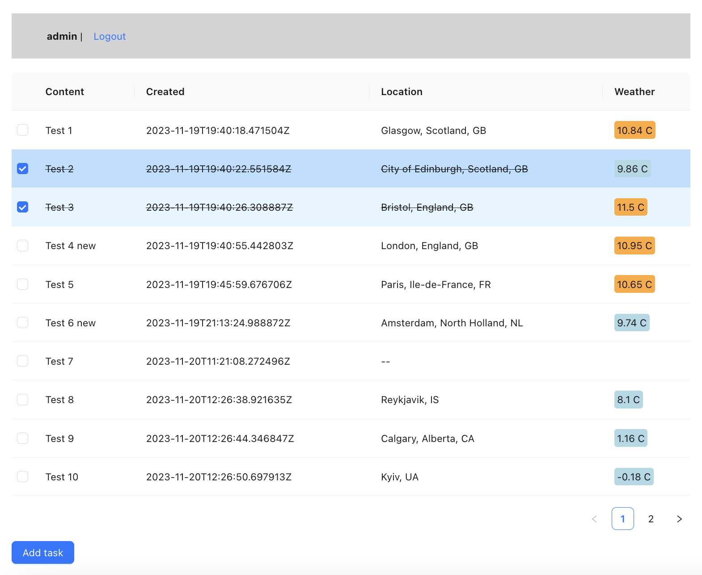

## Example TODO application



## Prerequisites:
Go to https://openweathermap.org sign up, then get your API key.
After that add your API key to `./backend/env/openweathermap.env`

## How to run the project:
```bash
docker compose build
docker compose up
```

In separate terminal, connect to Django app container
to initialize database schema and load initial data
(user with login `admin` and password `admin`, use it
for testing only):
```bash
docker compose exec backend bash
./manage.py migrate
./manage.py loaddata initial-data.json
```

You can access application by pointing your browser to http://localhost:8080.
Use login: `admin`, password: `admin` to log in and to test the application.

Remove docker volumes (to clear database):
```bash
docker compose down --volumes
```
